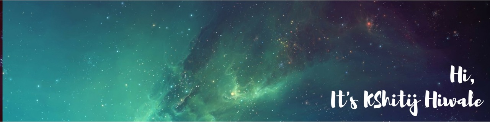

# Hey there :wave:

 
  Visitor count 
  

## About me 😶
---
### I'm Kshitij. An undergardute student. Self taught programmer. Python is my most sharpened weapon.

### My main goal is to learn & contribute.

<!-- --- -->
<!-- ## What you will find here -->
<!--  -->
---

## 🛠  Technologies that I'm familiar with :

[][tech_tools_anchor]

[][tech_tools_anchor]

[][tech_tools_anchor]
&nbsp;
[][tech_tools_anchor]
&nbsp;
[][tech_tools_anchor]
&nbsp;
[][tech_tools_anchor]
&nbsp;
[][tech_tools_anchor]
&nbsp;
[][tech_tools_anchor]
&nbsp;
[][tech_tools_anchor]
&nbsp;
[][tech_tools_anchor]
&nbsp;
[][tech_tools_anchor]
&nbsp;
[][tech_tools_anchor]
&nbsp;
[][tech_tools_anchor]
&nbsp;
[][tech_tools_anchor]
&nbsp;

[tech_tools_anchor]: #hi--
[learning_now_anchor]: #learning-now
---

## Interests: 
- Anime
- Physics
- Video Games
---
## Get in touch 👇

- [Portfolio](https://silvomor.pythonanywhere.com/)
- [LinkedIn](https://www.linkedin.com/in/sagarviradiya)
- And of course GitHub you're already on.
---
